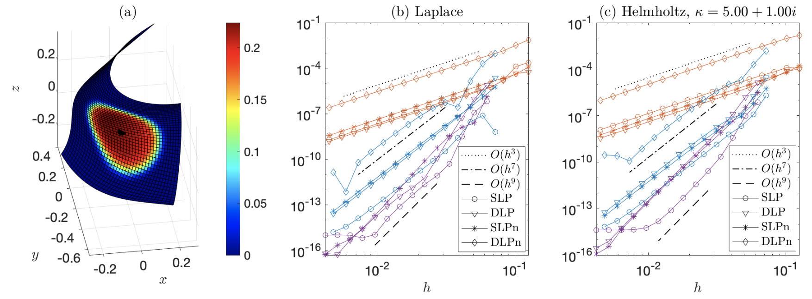
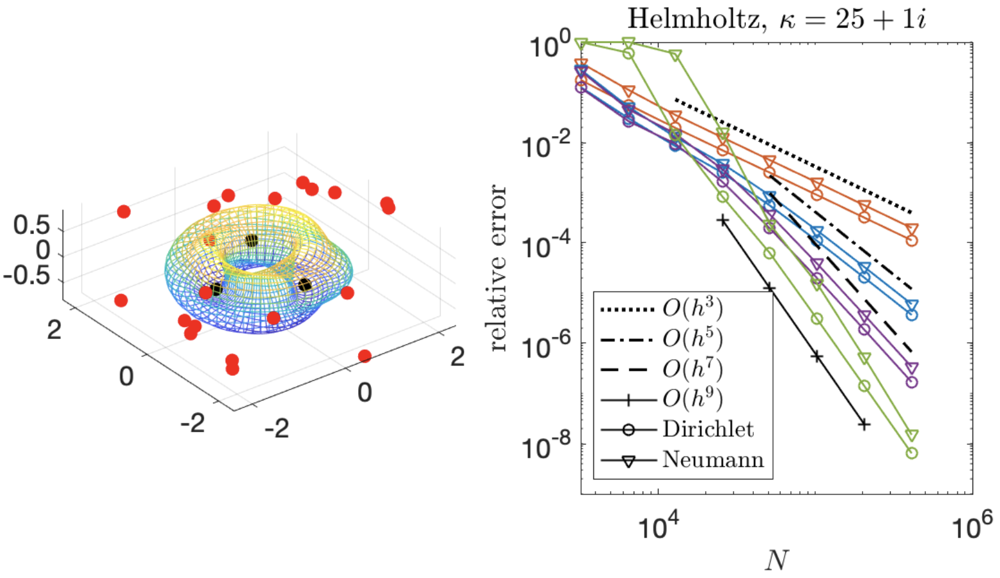
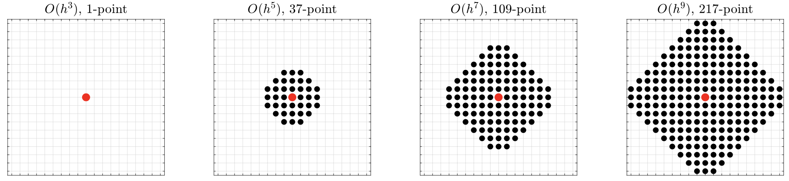
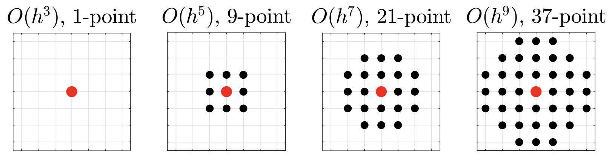

# ZetaTrap3D_Unified: High-order trapezoidal quadrature rules for singular and hypersingular integral operators on surfaces in 3D

This is the MATLAB code accompanying the manuscript: 

* B. Wu and P.G. Martinsson, A Unified Trapezoidal Quadrature Method for Singular and Hypersingular Boundary Integral Operators on Curved Surfaces (2022, in preparation)

This code provides accurate on-surface evaluation (up to 9-th order) of any Laplace and Helmholtz layer potentials on a smooth surface parameterized over a rectangular domain. The layer potentials are discretized uniformly using the double trapezoidal rule, with local high-order corrections on a small stencil around the singular point.

Author: Bowei Wu, 2022/6

- This code is an improvement to [ZetaTrap3D](https://github.com/bobbielf2/ZetaTrap3D) (but with a trade-off, see comparison below)
- Also contain supporting functions modified from Alex Barnett's [BIE3D](https://github.com/ahbarnett/BIE3D) package
- See also the related [ZetaTrap2D](https://github.com/bobbielf2/ZetaTrap2D) code for contour integrals.

TO-DO: Stokes & Maxwell kernels.

### Examples

**Example 1:** ZetaTrap approximations of layer potentials on a surface patch with a smooth and compactly supported density function. Target is located at the center of the patch. High-order convergence against mesh size h are shown in **(b)** for the Laplace potentials and **(c)** for the Helmholtz potentials. Convergence of 3rd order (red), 7th order (blue) and 9th order (purple) are shown for the SLP (circles), DLP (triangles), and the normal derivative of SLP (asterisks). Convergence up to 7th order are shown for the normal derivative of DLP (diamonds), which is hypersingular.  (This figure is extracted from the manuscript.)

**Example 2:** Solving the Helmholtz BVPs exterior to a toroidal surface using the ZetaTrap quadrature. CFIE formulations are used. Wavenumber is k = 25 + i (12 wavelengths across the geometry). **Left panel:** geometry setup. The exact solution is generated by interior point sources (black dots) and the accuracy is measured at exterior test points (red dots). **Right panel:** Convergence of 3rd order (red), 5th order (blue), 7th order (purple), and 9th order (green) are observed for both the Dirichlet (circles) and Neumann (triangles) problems.

### Description of the main test files:

* `test_lap3d_on_patch.m`, `test_helm3d_on_patch.m` : evaluation of the Laplace, or Helmholtz, layer potentials compactly supported on a surface patch. These routines contain self convergence tests. (See example 1 above.)
* `test_lap3d_bie.m`, `test_helm3d_bie.m` : solution of the Laplace, or Helmholtz, Dirichlet and Neumann problems exterior to a toroidal surface. These routines contain convergence tests. (See example 2 above.)

Supporting functions:

* `epstein_zeta.m` : evaluation of the Epstein zeta function and its parametric derivatives (up to 4th order).
* `epstein_zeta10.m`: same as `epstein_zeta.m` but with up to 10th order parametric derivatives.
* `incgamma.m` : custom fast implementation of the (scaled) upper incomplete gamma function that takes negative arguments (called by `epstein_zeta.m`)
* `incgamma10.m` : same as `incgamma.m` but called by `epstein_zeta10.m`
* `Lap3dPatchZetaSparse_multi.m` : construct sparse correction matrices associated with the Laplace layer potentials
* `Helm3dPatchZetaSparse_multi.m` : construct sparse correction matrices associated with the Helmholtz layer potentials
* `Lap3dSLPmat.m`, `Lap3dDLPmat.m` : construct matrices associated with Laplace layer potentials using native quadratures
* `Helm3dSLPmat.m`, `Helm3dDLPmat.m` : construct matrices associated with Helmholtz layer potentials using native quadratures
* `quadr_doubleptr2.m`, `wobblytorus2.m`, `showsurf.m` are (modified) functions from [BIE3D](https://github.com/ahbarnett/BIE3D) to support the examples on toroidal surfaces.

### Note on MATLAB version

- If you are using a MATLAB version before R2017b, please rename the `utils/Vecnorm.m` function to lower case `vecnorm.m` to use this code.
- For quadrature corrections, the Epstein zeta function `epstein_zeta(s,...)` and the custom upper incomplete gamma function `incgamma(s,x)` are used only with real `s`. In case you would like to feed a complex `s` into these functions, the `igamma` function from the Symbolic Math Toolbox is required (which is slow).

### Comparison with ZetaTrap3D

Compared to the earlier version [ZetaTrap3D](https://github.com/bobbielf2/ZetaTrap3D), the current code only requires only the first derivatives of the geometric parameterization, which significantly simplifies the procedure to derive high-order corrections and is much easier to adapt to different kernels and on different surfaces. As a trade-off, the local correction stencils are generally larger than [ZetaTrap3D](https://github.com/bobbielf2/ZetaTrap3D).

As an exapmle, here are the stencils for various orders of corrections for the Laplace SLP:

In comparison, [ZetaTrap3D](https://github.com/bobbielf2/ZetaTrap3D) uses much smaller stencils at higher orders:

However, the derivation of correction formulas are too tedious and involves too many derivatives to be practical, so only 5th-order quadratures rules are derived in [ZetaTrap3D](https://github.com/bobbielf2/ZetaTrap3D).
